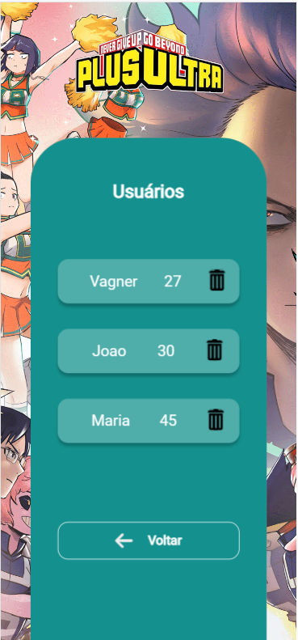
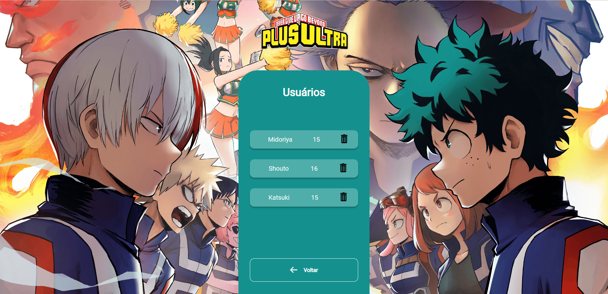

# Tela de Cadastro de usuário

> Resultado do Projeto

### Ajustes e melhorias

O projeto trata-se de uma tela de cadastro de usuário, onde é possivel adicionar nome e idade dentro do input, os dados são enviados para uma API.

A página é redirecionada para a tela de usuários, que acessa a API e exibe os dados. dentro da tela de usuários é possível deleta-los.

- [x] Criação do React app
- [x] Criação do Styled-components
- [x] Conexão com API
- [x] Responsividade

## 🤝 Colaboradores

Agradecemos às seguintes pessoas que contribuíram para este projeto:

<table>
  <tr>
    <td align="center">
      <a href="#">
         
        
          <b>Vagner Santos</b>
        
      </a>
    </td>
  </tr>
</table>
